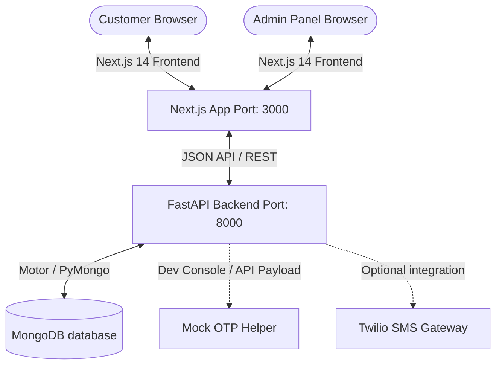

# ⚡ FreshCart - Premium 10-Minute Grocery Delivery Storefront (Zepto Clone)

Welcome to **FreshCart**, a state-of-the-art, high-performance grocery delivery application modeled after modern instant-delivery apps like Zepto. FreshCart features a vibrant deep-purple and hot-pink aesthetic, seamless transitions, dynamic search and categorization, custom circular categories with image upload support, interactive quantity steppers, and a complete order management workflow.

---

## 🏗️ Architecture & Technology Stack

The project is split into two primary layers (Frontend and Backend) to ensure clean separation of concerns, easy scalability, and quick deployments.



### Backend (API Service)
* **Core Framework**: [FastAPI](https://fastapi.tiangolo.com/) (Python 3.9+) for high-speed, type-safe REST APIs.
* **Database**: [MongoDB](https://www.mongodb.com/) (using Motor for asynchronous CRUD operations).
* **Security & Tokens**: JWT (JSON Web Tokens) with SHA256 hashed OTP verification codes.

### Frontend (User Interface)
* **Framework**: [Next.js 14](https://nextjs.org/) (React) utilizing the modern App Router.
* **Design & Styling**: Custom Vanilla CSS system ([globals.css](file:///c:/Users/ZML-WIN-DeepS-01/Desktop/FreshCart/frontend/styles/globals.css)) optimized for Outfit typography, glassmorphism, responsive grid sheets, and custom micro-animations (buttons scaling, cart bouncing, cards hovering).
* **State Management**: React Context APIs for centralizing user sessions, cart contents, and search queries.

---

## 🌟 Key Application Features

1. **Quick OTP Phone Login**:
   * Features passwordless authentication. Customers enter their phone number and receive a 6-digit verification code.
   * **Dev Mode Helper**: During local testing, the generated OTP is returned directly in the login API response and displayed on-screen in a yellow info box. No third-party account configuration is required out-of-the-box.
   * **Production-Ready**: Ready to swap with SMS carriers like Twilio or Fast2SMS.

2. **Ultra-Fast Storefront**:
   * **Search-as-you-type**: Instantly filters products matching your search terms.
   * **Emoji Circular Categories**: Clean rounded category selectors displaying uploaded category images, with built-in fallback emojis.
   * **Real-time Availability**: Automatically indicates stock thresholds. Displays **"Out of stock"** banners if inventory is exhausted.

3. **Dynamic Stepper ADD Button**:
   * Clicking **ADD** on a product card immediately transforms it into a custom quantity control stepper (`- 1 +`). 
   * Updates cart calculations (item totals, delivery fee waivers, taxes, and net price) in real time.

4. **Interactive Profile & Orders Dashboard**:
   * Customers can manage shipping profiles, view historical orders, check delivery progress status (Pending, Ready, Dispatched, Delivered), and download invoices.

5. **Advanced Admin Dashboard**:
   * **Inventory Control**: Update product pricing, descriptions, stock availability, and manage restock counts.
   * **Category Builder**: Create categories with descriptions and upload image covers.
   * **Live Order Fulfilment**: View incoming customer orders and mark progress milestones (e.g., packing, dispatching).

---

## 🚀 How to Run the Project Locally

Follow these quick steps to get the backend and frontend up and running.

### 📋 Prerequisites
Make sure you have the following installed on your machine:
* [Node.js](https://nodejs.org/) (v18.x or above)
* [Python](https://www.python.org/) (v3.9 or above)
* [MongoDB](https://www.mongodb.com/try/download/community) (running locally on port `27017` or a MongoDB Atlas URI string)

---

### Step 1: Set Up & Start the Backend

1. Navigate to the backend directory:
   ```bash
   cd backend
   ```

2. Create a Python virtual environment and activate it:
   * **Windows (PowerShell)**:
     ```powershell
     python -m venv venv
     .\venv\Scripts\Activate.ps1
     ```
   * **Mac/Linux**:
     ```bash
     python3 -m venv venv
     source venv/bin/activate
     ```

3. Install the required dependencies:
   ```bash
   pip install -r requirements.txt
   ```

4. Create a `.env` file in the root of the `backend` folder:
   ```env
   MONGO_URI=mongodb://localhost:27017/freshcart
   JWT_SECRET=super-secret-key-change-in-production
   JWT_ALGORITHM=HS256
   ```

5. Start the backend API server:
   ```bash
   uvicorn app.main:app --reload --port 8000
   ```
   * The API docs will be available at [http://localhost:8000/docs](http://localhost:8000/docs).

---

### Step 2: Set Up & Start the Frontend

1. Open a new terminal window and navigate to the frontend directory:
   ```bash
   cd frontend
   ```

2. Install the Node packages:
   ```bash
   npm install
   ```

3. Create a `.env.local` file in the root of the `frontend` folder:
   ```env
   NEXT_PUBLIC_API_URL=http://localhost:8000
   ```

4. Compile and start the development server:
   ```bash
   npm run dev
   ```
   * The application storefront will be live at [http://localhost:3000](http://localhost:3000).

---

## 🧪 Testing Credentials (For Client Review)

When presenting this application to the client, you can use these instructions to demonstrate functions:

### 👤 Customer Login
1. Open [http://localhost:3000/auth](http://localhost:3000/auth).
2. Choose **Phone OTP** login.
3. Enter any phone number (e.g., `+919999999999`).
4. Click **Continue**. A yellow info banner will display: `Dev Mode: Your verification code is XXXXXX`.
5. Enter the 6-digit code shown in the banner to log in.

### 🔑 Admin Access
1. Navigate to [http://localhost:3000/admin](http://localhost:3000/admin).
2. Log in using the default admin credentials configured in the system:
   * **Email**: `admin@freshcart.com`
   * **Password**: `admin123`
3. In this panel, you can add mock products, restock existing items, create new categories with images, and update order statuses.

---

## 🛡️ Production & Twilio Configuration

To launch this application in a live production environment with real SMS delivery:

### 1. Twilio Integration (Real SMS OTP)
Sign up for a free trial or paid account on [Twilio](https://www.twilio.com) and add the following keys to your backend `.env` configuration file:
```env
TWILIO_ACCOUNT_SID=your_account_sid_here
TWILIO_AUTH_TOKEN=your_auth_token_here
TWILIO_PHONE_NUMBER=your_twilio_virtual_phone_number
```

Update the `send_otp` service inside `backend/app/services/auth/auth_service.py` to trigger Twilio's client:
```python
from twilio.rest import Client

client = Client(settings.TWILIO_ACCOUNT_SID, settings.TWILIO_AUTH_TOKEN)
client.messages.create(
    body=f"Your FreshCart verification code is {otp}",
    from_=settings.TWILIO_PHONE_NUMBER,
    to=phone
)
```

### 2. Multi-User Concurrency & Stock Locks
The backend utilizes asynchronous MongoDB transactions to prevent overselling. If multiple users attempt to check out the last remaining stock of an item concurrently, the database locks the inventory document, processes requests sequentially, and gracefully returns an `"Out of Stock"` response to subsequent users to prevent double-selling.
