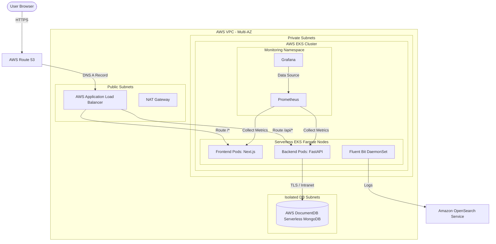

# ☁️ AWS EKS Production Deployment Architecture & DevOps Guide

This document outlines the end-to-end production architecture and setup instructions for deploying **FreshCart** on AWS Cloud using Kubernetes (EKS), Terraform, GitHub Actions, ArgoCD, and Helm-based observability stacks.

---

## 🏛️ AWS Cloud Deployment Architecture

Below is the visual deployment architecture for running the Next.js frontend, FastAPI backend, and Serverless MongoDB database on AWS.



---

## 🛠️ Infrastructure as Code: Terraform Layout

We use Terraform to spin up the VPC, EKS Cluster, ECR Registries, IAM Roles for Service Accounts (IRSA), and OIDC provider.

### Directory Structure
```text
terraform/
├── main.tf                 # Core providers & state settings
├── variables.tf            # Configurable vars (region, cluster name)
├── vpc.tf                  # VPC, subnets, NAT Gateways
├── eks.tf                  # EKS Cluster & Fargate profiles
├── ecr.tf                  # Elastic Container Registry repos
├── iam_oidc.tf             # OpenID Connect for GitHub Actions
└── outputs.tf              # Outputs (EKS endpoint, ECR URLs)
```

### GitHub Actions OIDC Role (`iam_oidc.tf`)
This Terraform snippet creates the IAM role allowing GitHub Actions to authenticate securely with AWS via OIDC without storing permanent credentials.

```hcl
# OIDC Provider for GitHub
resource "aws_iam_openid_connect_provider" "github" {
  url             = "https://token.actions.githubusercontent.com"
  client_id_list  = ["sts.amazonaws.com"]
  thumbprint_list = ["15e12e70684c9d019f07454eff822068e146522c"] # GitHub certificate thumbprint
}

# IAM Role for GitHub Actions CI
resource "aws_iam_role" "github_actions" {
  name = "github-actions-ecr-push-role"

  assume_role_policy = jsonencode({
    Version = "2012-10-17"
    Statement = [
      {
        Effect = "Allow"
        Principal = {
          Federated = aws_iam_openid_connect_provider.github.arn
        }
        Action = "sts:AssumeRoleWithWebIdentity"
        Condition = {
          StringEquals = {
            "token.actions.githubusercontent.com:aud" = "sts.amazonaws.com"
          }
          StringLike = {
            "token.actions.githubusercontent.com:sub" = "repo:YOUR_GITHUB_ORG/FreshCart:*"
          }
        }
      }
    ]
  })
}

# Attach permissions to push to ECR
resource "aws_iam_role_policy_attachment" "ecr_poweruser" {
  role       = aws_iam_role.github_actions.name
  policy_arn = "arn:aws:iam::aws:policy/AmazonEC2ContainerRegistryPowerUser"
}
```

---

## 📦 CI Pipeline: GitHub Actions

This pipeline triggers on every push to the `main` branch. It authenticates to AWS using OIDC, builds the Docker images for frontend and backend, and pushes them to Amazon ECR.

Create this file at `.github/workflows/ci.yml`:

```yaml
name: Build and Push to ECR

on:
  push:
    branches: [ main ]

permissions:
  id-token: write # Required for requesting the AWS JWT OIDC token
  contents: read

env:
  AWS_REGION: us-east-1
  ROLE_TO_ASSUME: arn:aws:iam::123456789012:role/github-actions-ecr-push-role
  ECR_REGISTRY: 123456789012.dkr.ecr.us-east-1.amazonaws.com

jobs:
  build-and-push:
    runs-on: ubuntu-latest
    steps:
      - name: Checkout Code
        uses: actions/checkout@v3

      - name: Configure AWS Credentials (OIDC)
        uses: aws-actions/configure-aws-credentials@v2
        with:
          role-to-assume: ${{ env.ROLE_TO_ASSUME }}
          aws-region: ${{ env.AWS_REGION }}
          audience: sts.amazonaws.com

      - name: Login to Amazon ECR
        id: login-ecr
        uses: aws-actions/amazon-ecr-login@v1

      # 1. Build and Push Backend Image
      - name: Build & Push Backend
        run: |
          docker build -t ${{ env.ECR_REGISTRY }}/freshcart-backend:${{ github.sha }} ./backend
          docker tag ${{ env.ECR_REGISTRY }}/freshcart-backend:${{ github.sha }} ${{ env.ECR_REGISTRY }}/freshcart-backend:latest
          docker push ${{ env.ECR_REGISTRY }}/freshcart-backend:${{ github.sha }}
          docker push ${{ env.ECR_REGISTRY }}/freshcart-backend:latest

      # 2. Build and Push Frontend Image
      - name: Build & Push Frontend
        run: |
          docker build \
            --build-arg NEXT_PUBLIC_API_URL="https://api.yourdomain.com" \
            -t ${{ env.ECR_REGISTRY }}/freshcart-frontend:${{ github.sha }} ./frontend
          docker tag ${{ env.ECR_REGISTRY }}/freshcart-frontend:${{ github.sha }} ${{ env.ECR_REGISTRY }}/freshcart-frontend:latest
          docker push ${{ env.ECR_REGISTRY }}/freshcart-frontend:${{ github.sha }}
          docker push ${{ env.ECR_REGISTRY }}/freshcart-frontend:latest
```

---

## ⛵ CD Pipeline: GitOps with ArgoCD

ArgoCD monitors your Git repository containing the Kubernetes manifest files (YAMLs or Helm templates) and synchronizes changes automatically with EKS.

### ArgoCD Application Manifest (`argocd-app.yaml`)
Deploy this file to your EKS cluster to monitor your deployment repository:

```yaml
apiVersion: argoproj.io/v1alpha1
kind: Application
metadata:
  name: freshcart
  namespace: argocd
spec:
  project: default
  source:
    repoURL: 'https://github.com/YOUR_GITHUB_ORG/freshcart-gitops.git'
    targetRevision: HEAD
    path: k8s/environments/production
  destination:
    server: 'https://kubernetes.default.svc'
    namespace: freshcart
  syncPolicy:
    automated:
      prune: true
      selfHeal: true
```

---

## 💾 Serverless Database: AWS DocumentDB Serverless

We utilize **AWS DocumentDB Serverless** as a fully-managed MongoDB-compatible database. It dynamically scales storage and compute throughput up and down based on real-time request traffic, eliminating the overhead of managing EC2 instances.

### Connecting the FastAPI Backend
To connect the Python backend securely inside the private subnets:
1. Update your backend deployment environmental settings in Kubernetes:
   ```yaml
   env:
     - name: MONGO_URI
       value: "mongodb://<db_username>:<db_password>@freshcart-docdb-cluster.us-east-1.docdb.amazonaws.com:27017/freshcart?tls=true&tlsCAFile=/app/rds-combined-ca-bundle.pem&replicaSet=rs0&readPreference=secondaryPreferred&retryWrites=false"
   ```
2. Download the Amazon RDS CA certificate inside your backend Dockerfile:
   ```dockerfile
   RUN wget https://s3.amazonaws.com/rds-downloads/rds-combined-ca-bundle.pem -O /app/rds-combined-ca-bundle.pem
   ```

---

## 📊 Helm Deployment: GitOps, Monitoring & Logging (EFK)

This section details how to install all cluster dependencies using Helm. We deploy **Elasticsearch and Kibana directly inside EKS** (configured in single-node mode) to keep costs low and bypass expensive Amazon OpenSearch billing.

---

### 1. Install ArgoCD via Helm
We run ArgoCD to handle automatic continuous delivery of Kubernetes manifests using GitOps.

```bash
# Add ArgoCD Helm repository
helm repo add argo https://argoproj.github.io/argo-helm
helm repo update

# Install ArgoCD
helm install argocd argo/argo-cd \
  --namespace argocd \
  --create-namespace

# Retrieve admin password to log in:
kubectl -n argocd get secret argocd-initial-admin-secret \
  -o jsonpath="{.data.password}" | base64 --decode
```

---

### 2. Observability: Prometheus & Grafana
Installs the full Prometheus Operator stack including Grafana dashboard analytics.

```bash
# Add Prometheus Helm repository
helm repo add prometheus-community https://prometheus-community.github.io/helm-charts
helm repo update

# Install Prometheus Stack
helm install prometheus prometheus-community/kube-prometheus-stack \
  --namespace monitoring \
  --create-namespace \
  --set grafana.adminPassword="your-secure-grafana-password"

# Access Grafana Dashboard locally:
kubectl port-forward svc/prometheus-grafana 8080:80 -n monitoring
```

---

### 3. Log Storage & UI: Elasticsearch & Kibana (EFK Stack)
To avoid high OpenSearch hosting fees, we run a single-node Elasticsearch cluster inside EKS.

```bash
# Add Elastic Helm repository
helm repo add elastic https://helm.elastic.co
helm repo update

# Install a single-node Elasticsearch cluster (low memory footprint for development)
helm install elasticsearch elastic/elasticsearch \
  --namespace logging \
  --create-namespace \
  --set replicas=1 \
  --set minimumMasterNodes=1 \
  --set resources.requests.cpu="100m" \
  --set resources.requests.memory="512Mi" \
  --set resources.limits.cpu="1000m" \
  --set resources.limits.memory="1Gi"

# Install Kibana Dashboard
helm install kibana elastic/kibana \
  --namespace logging \
  --set resources.requests.cpu="100m" \
  --set resources.requests.memory="512Mi" \
  --set resources.limits.cpu="1000m" \
  --set resources.limits.memory="1Gi"

# Access Kibana UI:
kubectl port-forward svc/kibana-kibana 5601:5601 -n logging
```

---

### 4. Log Shipper: Fluent Bit
Fluent Bit runs as a DaemonSet, scraping stdout console logs from all running pods and shipping them to our internal Elasticsearch service.

```bash
# Add Fluent Helm repository
helm repo add fluent https://fluent.github.io/helm-charts
helm repo update

# Install Fluent Bit pointing to the local Elasticsearch service
helm install fluent-bit fluent/fluent-bit \
  --namespace logging \
  --set backend.type=es \
  --set backend.es.host="elasticsearch-master.logging.svc.cluster.local" \
  --set backend.es.port=9200 \
  --set backend.es.tls=Off \
  --set backend.es.tls_verify=Off
```

---

## 💰 Cost-Optimized Alternative Deployment (Low Budget: <$20/Month)

If you are deploying this for staging, client review, or a low-traffic startup, the full EKS + NAT Gateway + OpenSearch stack is extremely expensive (~$250+/month). Below is the cost-optimized alternative architecture that reduces your monthly AWS bill to **under $20/month**.

### 1. The Cost-Optimized Architecture
* **Compute**: Run a single AWS **EC2 instance** (`t3.small` or `t3.medium`, costing ~$12-$20/mo) in a **public subnet** with an Elastic IP.
* **Orchestration**: Run frontend and backend as Docker containers using **Docker Compose** on the EC2 instance.
* **No NAT Gateway**: Since the EC2 instance resides in a public subnet, it communicates directly with the internet (e.g. pulling ECR images, calling Twilio API) without needing any NAT Gateway ($0/mo).
* **Database**: Use the **MongoDB Atlas Free Tier** (M0 cluster, $0/mo) or host MongoDB in a Docker container inside the same EC2 instance with a persistent block volume.
* **Logging & Monitoring**: Instead of OpenSearch and Prometheus, use local Docker log rotation (`json-file` driver with 50MB limit) and view logs via CLI, or stream to **Amazon CloudWatch Logs** (which has a 5GB free tier).

---

### 2. Docker Compose Setup on EC2

Create a `docker-compose.yml` file in the project folder on your EC2 node:

```yaml
version: '3.8'

services:
  backend:
    image: 123456789012.dkr.ecr.us-east-1.amazonaws.com/freshcart-backend:latest
    ports:
      - "8000:8000"
    environment:
      - MONGO_URI=mongodb+srv://<user>:<password>@cluster0.mongodb.net/freshcart?retryWrites=true&w=majority
      - JWT_SECRET=change-this-in-production
    restart: always
    logging:
      driver: "json-file"
      options:
        max-size: "50m"
        max-file: "3"

  frontend:
    image: 123456789012.dkr.ecr.us-east-1.amazonaws.com/freshcart-frontend:latest
    ports:
      - "80:3000"
    environment:
      - NEXT_PUBLIC_API_URL=http://<YOUR_EC2_PUBLIC_IP_OR_DOMAIN>:8000
    restart: always
    logging:
      driver: "json-file"
      options:
        max-size: "50m"
        max-file: "3"
```

---

### 3. Lightweight AWS ECS Fargate Option (Serverless Containers)
If you want serverless scaling without EKS and NAT Gateway:
1. Create an **AWS ECS Cluster** (which is free of control plane charges).
2. Create **ECS Fargate Tasks** for frontend and backend.
3. Configure them to run in a **Public Subnet** and enable **"Assign Public IP"** on the tasks.
4. This allows Fargate tasks to directly query the internet (pull Docker images from ECR public/private repositories and connect to MongoDB Atlas) without using a NAT Gateway.
5. Configure logs to route directly to **AWS CloudWatch (awslogs driver)**, avoiding the heavy cost of OpenSearch.

```
